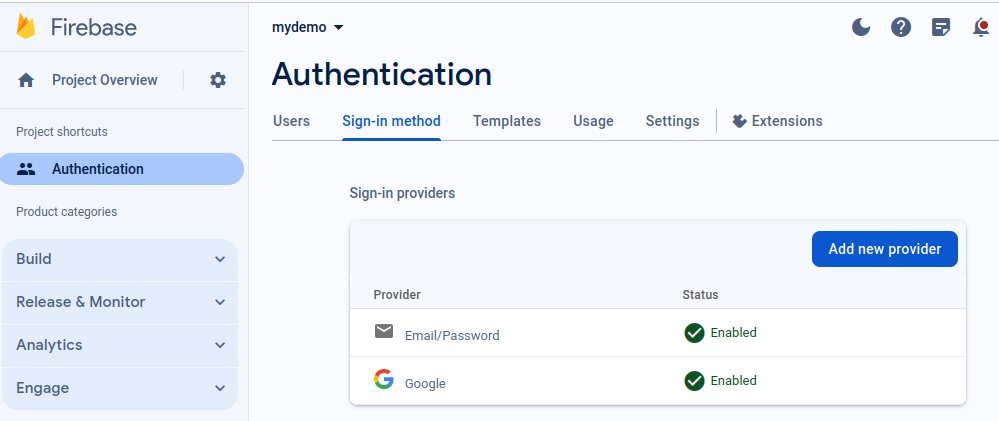
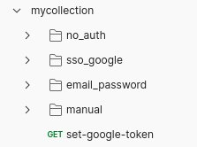
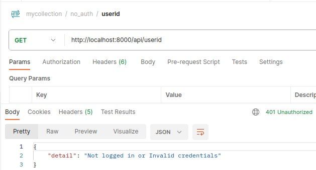
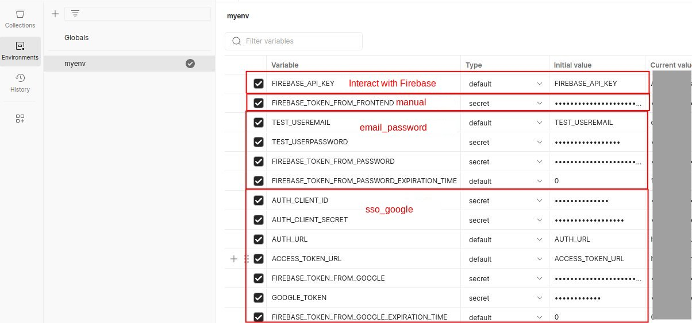
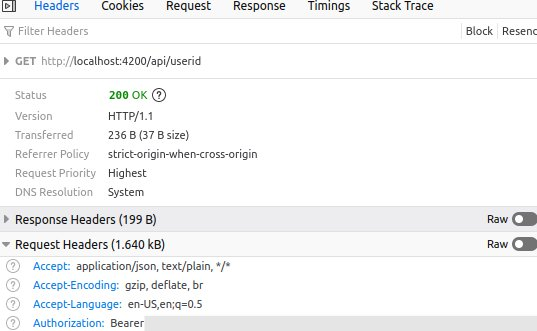
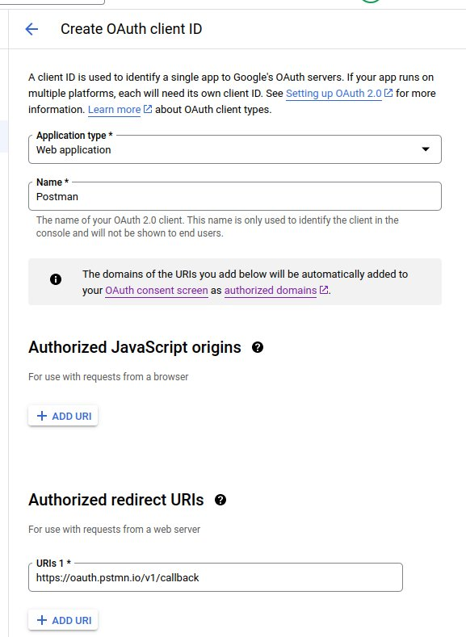
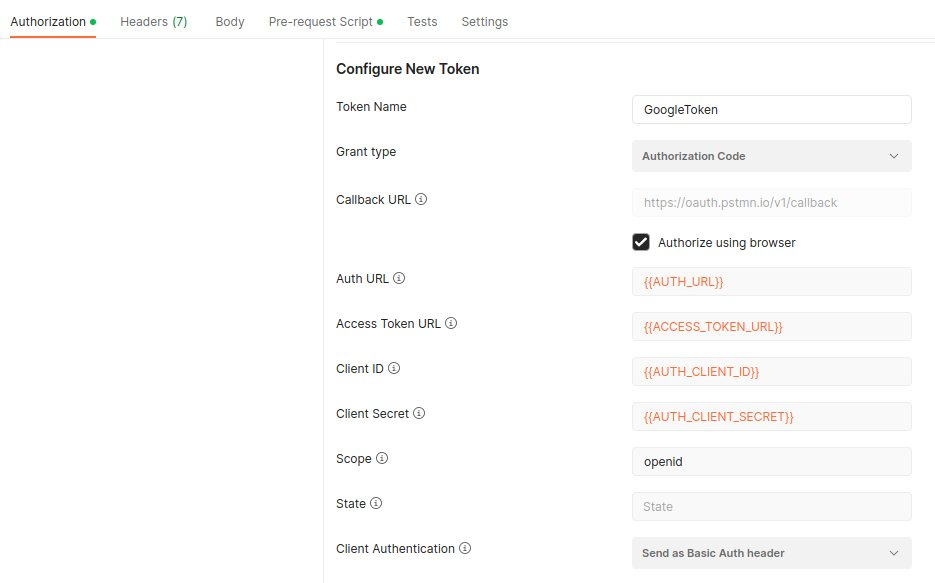
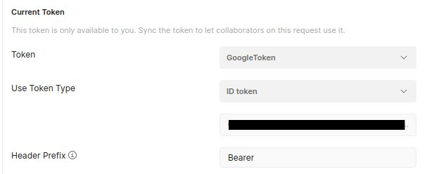
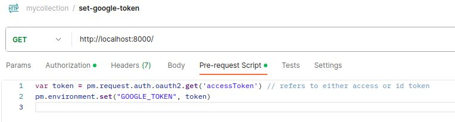

The goal of this article is to provide an easy guide on how you can set up Postman to test backend routes that rely on Firebase-authenticated users.

This article follows these 2 articles:

- [[Firebase authentication in angular]]
- [[Firebase authentication - fastapi backend]]
As such, I assume you have a frontend application handling authentication with Firebase as well as a backend API with routes that expect Firebase-authenticated users.
However it does not matter if you chose other languages / frameworks, Postman setup will be identical

## Reminder: Frontend / backend standard flow

To enable Firebase Authentication, go to your Firebase console, then click on `Authentication` then `Sign-in method` and add the providers. Notably,
`Google` and `Email/Password` providers can be activated without any extra set up.



When implementing Firebase authentication in your application, Frontend libraries make it very easy to authenticate and retrieve the ID token of an authenticated user.

For example in angular:

```ts
import { AngularFireAuth } from '@angular/fire/compat/auth';
import { GoogleAuthProvider } from '@firebase/auth';

...

// example functions to sign in
async googleSignIn(){
	const credential = await this.angularFireAuth.signInWithPopup(
		new GoogleAuthProvider()
	);
}
async emailPasswordSignIn(){
    await this.angularFireAuth.signInWithEmailAndPassword(email, password);
}


// retrieves firebase token of authenticated user
  async getUserToken(): Promise<string | undefined> {
    const firebaseUser = await this.angularFireAuth.currentUser;
    const token = await firebaseUser?.getIdToken();
    return token;
}
```

To connect to backend routes that require Firebase authentication, you need to add the obtained ID token in the Authorization header: `{ Authorization: Bearer <user-token> }`
The backend then validates the ID token and returns an error in case of failure. For ex in python:

```python
from firebase_admin.auth import verify_id_token

try:
	verify_id_token(token)
	print("Valid token")
except Exception:
	print("Invalid token")
```

To summarize the flow is:

- User connects to frontend
- User authenticate with Firebase Authentication
- Upon success, Firebase issues an id token
- Frontend attaches the token to Authorization header when calling a backend route
- Backend validates the token
- Upon success, Backend applies its logic and returns response to frontend

Note that the id token is a JWT encoded in base64. If you decode it , you will get something looking like this:

```json
{
  "header": {
    "alg": "RS256",
    "kid": "<public-key-id>",
    "typ": "JWT"
  },
  "payload": {
    "name": "John Doe",
    "picture": "<link-to-profile-picture>",
    "iss": "https://securetoken.google.com/<your-gcp-app>",
    "aud": "<your-gcp-app>",
    "auth_time": <authentication-timestamp>,
    "user_id": "<firebase-user-id>",
    "sub": "<firebase-user-id>",
    "iat": <jwt-issued-at-timestamp>,
    "exp": <jwt-expiration-timestamp>,
    "email": "<user-email>",
    "email_verified": <boolean>,
    "firebase": {
      "identities": {
        "google.com": [
          "<google-user-unique-id>"
        ]
      },
      "sign_in_provider": "google.com"
    }
  }
}
```

## Testing backend routes with Postman

When authenticating in the frontend, the frontend libraries do the heavy lifting. We actually don't really need to think on how the providers work. We only need to get the id token and attach it to the Authorization header.
The purpose of this section is to show how you can retrieve this token and add it to Postman in order to test your backend routes that require Firebase-authenticated users without having to go through the frontend.

### Initial setup

#### Collection

Before everything, you can create a new collection in Postman.



In `mycollection`, each folder contains the requests to test depending on the authentication method:

- `no_auth`: unauthenticated requests
- `manual`: Bearer token pasted directly
- `email_password`: Authentication with username password
- `sso_google`: Authentication with Google SSO

Note that the `set-google-token` GET request is at the root of the collection (more on that in the Google SSO section).

Each request in a folder will inherit the authorization method from its parent folder (default behavior in Postman, see `Authorization` tab).
In each folder, you can create a request that calls a backend route that expects an authenticated user so that you can test if the authentication is successful. For example, in my application, I have a route that returns the user id in case of success and a 401 error in case of failure. As expected if I do the request in the `no_auth` folder I get an error:


#### Environment

Now that the collection is created, you can also create a new environment that will contain the important variables. We will set the values in `Current value` later. For now, just use the `Initial value`


Don't forget to activate the environment to be able to use variables in your requests

### Option 1: Dirty solution: retrieving the token directly from the frontend

As we saw earlier, frontend libraries make it very easy to retrieve the token. So the most simple solution is to get the token from the frontend. Either `console.log` it or, if you already configured the frontend to send the token in the authorization header, just go to the network tab in the devtools and get it from here (take the value without the `Bearer` prefix). Note that certain devtools don't show the whole value so you might need to switch the display to raw to ensure you get the whole token.



In Postman, paste the value in the `Current value` of the environment variable `FIREBASE_TOKEN_FROM_FRONTEND` and save. Then in the `manual` folder,
in the `Authorization` tab, choose `Type = Bearer Token` and in the Token field, put `{{FIREBASE_TOKEN_FROM_FRONTEND}}` then save.

And there you have it! You can now run authenticated requests request in the `manual` folder.

The big issue is that you will have to redo the whole thing each time the token expires.

### Google Identity toolkit

Maybe we can do better that copying and pasting. What if you don't have access to the frontend and still want to test the backend?
Well fortunately, you can refer to https://firebase.google.com/docs/reference/rest/auth

For most of the authentication methods, you need to do a POST request to `https://identitytoolkit.googleapis.com/v1/accounts:<my-operation>?key=<firebase-api-key>`

- `<my-operation>` can be `signUp` for signing up to firebase with email and password, `signInWithPassword` to sign in with email and password, `signInWithIdp` to sign in with an identity provider, etc...
- `<firebase-api-key>` is the Firebase api key that you already added to your frontend. If needed you can find it in your firebase console by going to your `Project settings`, in the `General` tab (it is called `Web API Key`)

So actually, before moving forward, grab your firebase API key and paste it in the `Current value` of the environment variable `FIREBASE_API_KEY`

### Option 2: connecting with email/password

If you want to connect with email and password, it is just a matter of doing a POST request to `https://identitytoolkit.googleapis.com/v1/accounts:signInWithPassword?key=<firebase-api-key>` with the following body

```json
{

	"email": `${myemail}`,
	"password": `${mypassword}`,
	"returnSecureToken": true
}
```

The token will be in the `idToken` field of the response and you can use it for your next requests.

Similarly to what we did in Option 1, in the `email_password` folder, in the `Authorization` tab, choose `Bearer Token` and in the `Token` field, write `{{FIREBASE_TOKEN_FROM_PASSWORD}}`

Note that you need a valid email / password combination. You can store the values in the following environment variables: `TEST_USEREMAIL` and `TEST_USERPASSWORD`

Now, while you could do a POST request manually to retrieve the token (if you do be sure to set the `Authorization` tab to `No Auth`), you can instead use the following script (paste it in the `Pre-request` script tab of the `email_password` folder). This will automatically get the token for you and relaunch the request if the token is about to expire by setting the `FIREBASE_TOKEN_FROM_PASSWORD_EXPIRATION_TIME` variable. I took inspiration from https://medium.com/kinandcartacreated/google-authentication-with-postman-129 to create the script.

```json
// load env var
const FIREBASE_API_KEY = pm.environment.get("FIREBASE_API_KEY");
const TEST_USEREMAIL = pm.environment.get("TEST_USEREMAIL");
const TEST_USERPASSWORD = pm.environment.get("TEST_USERPASSWORD");
const FIREBASE_TOKEN_FROM_PASSWORD_EXPIRATION_TIME = pm.environment.get(
  "FIREBASE_TOKEN_FROM_PASSWORD_EXPIRATION_TIME",
);
const EXPIRATION_MARGIN = 1000;

// Only launch script if token is about to expire / expired
if (FIREBASE_TOKEN_FROM_PASSWORD_EXPIRATION_TIME) {
  const currentTimestamp = Math.floor(Date.now() / 1000);
  if (
    currentTimestamp + EXPIRATION_MARGIN >
    FIREBASE_TOKEN_FROM_PASSWORD_EXPIRATION_TIME
  ) {
    retrieveToken();
  } else {
    console.log("Using cached bearer token");
  }
}

// https://stackoverflow.com/questions/38552003/how-to-decode-jwt-token-in-javascript-without-using-a-library
// NOTE: does not validate the token
function parseJwt(token) {
  return JSON.parse(Buffer.from(token.split(".")[1], "base64").toString());
}

function retrieveToken() {
  const req = {
    url: `https://identitytoolkit.googleapis.com/v1/accounts:signInWithPassword?key=${FIREBASE_API_KEY}`,
    method: "POST",
    header: {
      Accept: "*/*",
      "Content-Type": "application/json",
    },
    body: {
      mode: "raw",
      raw: JSON.stringify({
        email: `${TEST_USEREMAIL}`,
        password: `${TEST_USERPASSWORD}`,
        returnSecureToken: true,
      }),
    },
  };

  pm.sendRequest(req, function (err, res) {
    console.log("Retrieving new token");

    if (err) {
      console.error(err);
      return;
    }
    const responseBody = res.json();
    pm.environment.set("FIREBASE_TOKEN_FROM_PASSWORD", responseBody.idToken);

    const decodedToken = parseJwt(responseBody.idToken);
    pm.environment.set(
      "FIREBASE_TOKEN_FROM_PASSWORD_EXPIRATION_TIME",
      decodedToken.exp,
    );
  });
}
```

In case of error, you can open the Postman console (`Ctrl+Alt+C`). But if you set up everything correctly, every request in the `email_password` folder should now be authenticated

### Option 3: Google SSO authentication

With Option 2, we now have a nice folder where authentication is handled without any need for user interaction. But you still need to store a username and a credential. But what if you want to simulate the whole OAuth2 flow where you would first need to connect to your google account and grant consent before running your requests?
Well, it is more tricky and it is the purpose of this section.

Note: If you don't know about OAuth2 and OpenId, I suggest reading this article first: https://developer.okta.com/blog/2019/10/21/illustrated-guide-to-oauth-and-oidc

#### Creating credentials in google console

Because you created your project in firebase, you can access it from your google cloud console.
In the google cloud console, search for `API & services`, then click on `Credentials`. In the `OAuth 2.0 Client IDs` section you should see `Web client (auto created by Google Service)`. This Web client is actually the one that was created by Firebase when you added the `Google` provider in the `Authentication`.

While you could use this client for the next part, I suggest creating a new client for Postman. Click `+ CREATE CREDENTIALS` then `Outh Client ID`

- `Application type`: `Web application`
- `Name`: `Postman`
- Add the following redirect URI: `https://oauth.pstmn.io/v1/callback` (see explanation after)
- Optionally, you can also customize the `OAuth consent screen` but for this setup, the only needed scope is `openid`
  

Note the client id and the client secret that appear after creation

#### Setting up environment variables in Postman

Update the environment variables for this section:

- `AUTH_CLIENT_ID` => the client id you just obtained
- `AUTH_CLIENT_SECRET` => the client secret you just obtained
- `AUTH_URL`: https://accounts.google.com/o/oauth2/auth
- `ACCESS_TOKEN_URL`: https://oauth2.googleapis.com/token

#### Retrieving the google id token in Postman

In the `set-google-token` request that was created at the root of `mycollection` (Important), go to the `Authorization` tab and choose `Type = OAuth 2.0` then fill the values.



Notes:

- The Callback URL matches the one we added when creating our `OAuth Client` in Google Cloud.
- The scope is `openid` because we want to retrieve an id Token

Now you can click on `Get New Access Token` to authenticate in the browser. If everything worked correctly, in the pop up that appears, click `Use Token`. Scroll up and you should see the value of the token. Note that you need to modify `Use Token Type` to `ID Token`



If you decode the JWT token, you will get something like this:

```json
{
  "header": {
    "alg": "RS256",
    "kid": "<publick-key-id>",
    "typ": "JWT"
  },
  "payload": {
    "iss": "accounts.google.com",
    "azp": "<google-web-client-id>",
    "aud": "<google-web-client-id>",
    "sub": "<google-user-unique-id>",
    "email": "<user-email>",
    "email_verified": <boolean>,
    "at_hash": "<cryptographic-hash-value>",
    "iat": <jwt-issued-at-timestamp>,,
    "exp": <jwt-expiration-timestamp>
  }
}
```

Now if you followed, you will realize this is not a Firebase token and therefore we can not use it to authenticate our requests.

Similarly to the user/password flow, we need to do a post request to `https://identitytoolkit.googleapis.com/v1/accounts:signInWithIdp?key=${firebaseApiKey}` with the body

```json
{
	"postBody":`id_token=${googleToken}&providerId=google.com`,
	"requestUri":"http://localhost",
	"returnIdpCredential":true,
	"returnSecureToken":true
}
```

to get the actual Firebase token.
However, while postman allows us to use the google token, it does not allow us to use it in a request!

The solution is to save it as an environment variable.

I took inspiration from https://community.postman.com/t/how-to-automatically-set-oauth-2-0-access-token-as-variable/32295/7 for the setup.

Remember why I said to implement all the `Authorization` logic in a request at the root of the collection instead of a folder? Well, it allows us to add code in the pre-request script which will save the token we retrieved at the previous step in the `GOOGLE_TOKEN` environment variable.

Paste the following script in the `Pre-request script` tab

```js
// note that accessToekn refers to the idToken here
// provided you correctly set the Use Token Type field
var token = pm.request.auth.oauth2.get("accessToken");
pm.environment.set("GOOGLE_TOKEN", token);
```

Then we will just run the request with any destination. Here I chose `localhost:8000` but you can choose any route even if the GET request fails.



After running the request, check that the `GOOGLE_TOKEN` variable was updated before the next step.

#### Getting the firebase token

Now that we have the google token, getting the firebase token is very similar to what we did in Option 2.
First, in the `sso_google` folder, in the `Authorization` tab, choose `Bearer Token` and in the `Token` field, write `{{FIREBASE_TOKEN_FROM_GOOGLE}}`

Then add the following pre-request script in the `sso_google` folder to automatically get the firebase token.

```js
const GOOGLE_TOKEN = pm.environment.get("GOOGLE_TOKEN");
const FIREBASE_API_KEY = pm.environment.get("FIREBASE_API_KEY");
const FIREBASE_TOKEN_FROM_GOOGLE_EXPIRATION_TIME = pm.environment.get(
  "FIREBASE_TOKEN_FROM_GOOGLE_EXPIRATION_TIME",
);

const EXPIRATION_MARGIN = 1000;

// inspired by https://medium.com/kinandcartacreated/google-authentication-with-postman-12943b63e76a
if (FIREBASE_TOKEN_FROM_GOOGLE_EXPIRATION_TIME) {
  const currentTimestamp = Math.floor(Date.now() / 1000);
  if (
    currentTimestamp + EXPIRATION_MARGIN >
    FIREBASE_TOKEN_FROM_GOOGLE_EXPIRATION_TIME
  ) {
    retrieveToken();
  } else {
    console.log("Using cached bearer token");
  }
}

// https://stackoverflow.com/questions/38552003/how-to-decode-jwt-token-in-javascript-without-using-a-library
// NOTE: does not validate the token
function parseJwt(token) {
  return JSON.parse(Buffer.from(token.split(".")[1], "base64").toString());
}

function retrieveToken() {
  console.log("Retrieving new token");
  console.log(GOOGLE_TOKEN);
  var payload = {
    postBody: `id_token=${GOOGLE_TOKEN}&providerId=google.com`,
    requestUri: "http://localhost",
    returnIdpCredential: true,
    returnSecureToken: true,
  };

  pm.sendRequest(
    {
      url: `https://identitytoolkit.googleapis.com/v1/accounts:signInWithIdp?key=${FIREBASE_API_KEY}`,
      method: "POST",
      header: {
        "Content-Type": "application/json",
      },
      body: {
        mode: "raw",
        raw: JSON.stringify(payload),
      },
    },
    function (err, res) {
      const errorMsg =
        "If the google token has expired, go to the set-google-token request, and get a new token in the Authorization tab. Then run the route to save it as an environment variable";

      if (err || res.code == 400) {
        console.error(err);
        console.log(errorMsg);
        throw new Error("Aborting request. Check the console");
      }
      const responseBody = res.json();

      pm.environment.set("FIREBASE_TOKEN_FROM_GOOGLE", responseBody.idToken);
      const decodedToken = parseJwt(responseBody.idToken);
      pm.environment.set(
        "FIREBASE_TOKEN_FROM_GOOGLE_EXPIRATION_TIME",
        decodedToken.exp,
      );
    },
  );
}
```

And that's it, now all the requests in `sso_google` are authenticated. Plus we mimicked the whole OAuth flow, which is nice.

Note that, if the firebase token has expired, you will get an error. To solve it, go back to the `set-google-token` request. In the `Authorization` tab, click on `Get new Access token`. You will have to set `Use Token Type` to `ID token` again. Then run the request to save the new `GOOGLE_TOKEN`.
