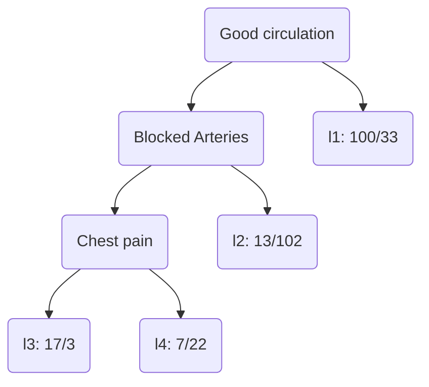

#datascience

## Definition

A Decision [[Tree]] is a hierarchical model that uses a series of if-then rules to make decisions or predictions based on input features.

At each step, go left if you answered yes and right if you answered no

- **Root node** = top of the tree
- **Internal nodes** = Intermediate nodes
- **Leaf nodes** = final nodes

## Classification

### Purity score

- A node is **pure** if it perfectly classifies all of the data
- Gini score = impurity for the node = 1 - (proba yes)² - (proba no)²
- Other scores can also be used such as log loss or entropy

- l1, l2, l3, and l4 are leaf nodes. The left value corresponds to people who have heart diseases and the right value corresponds to people who don't
- No nodes are pure. For ex, l2 score is `1 - (13/[13+102])² - (102/[13+102])²`
- Score of a given node is weighted average of children nodes => Score of a tree is weighted average of leaf nodes scores

### Building the tree from sample data

#### Steps

- For each parameter, calculate the impurity score resulting of using this parameter as the split
- If the node itself has the lowest score, there is no point in separating any more and it becomes a leaf node
- If separating the data results in an improvement, pick the separation with the lowest impurity score

#### Parameter types

- Boolean: if parameter is a boolean, simply split on yes/no
- Categorical data: Try a split on each category
- Multiple choice data: Try a split on each choice and combination of choice
- Numerical data: order the data and split on each interval. For ex if data is `1|3|4,|8`, try a split on `<2|<3.5|<6`
- Ranked data: same as numerical but split on the value itself : `<=1|<=2...`

### Feature selection

To avoid overfitting, you can require that each split makes a large reduction on impurity, give a min sample size, give a max depth to the tree.

- You can also prune complex trees by calculating a score as is: `Final score = Tree score + aT` where `a` is the Tree complexity penalty and T the nb of leaves => Complex trees are penalized. The higher `a`, the lower the depth of the final tree
- Note that `a` is an hyperparameter that can be selected via cross validation: choose the value of `a` that makes the `Tree score` minimal on the validation set (`Tree score` here is without the penalty)

## Regression

- Instead of classifying, we predict a numerical value
- Each leaf contains the average value of the remaining sample
- We use sum of squared residuals as score
- The rest is exactly the same as classification decision trees
