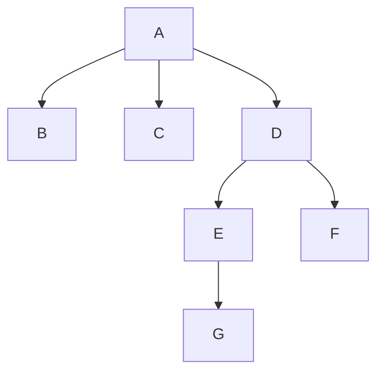

In graph theory, a tree is an unidirected [[Graph]] in which any two vertices are connected by exactly one path

In practice, it is a hierarchical data structure consisting of nodes connected by edges. Each node can have multiple children and each of these children can have their own children.

